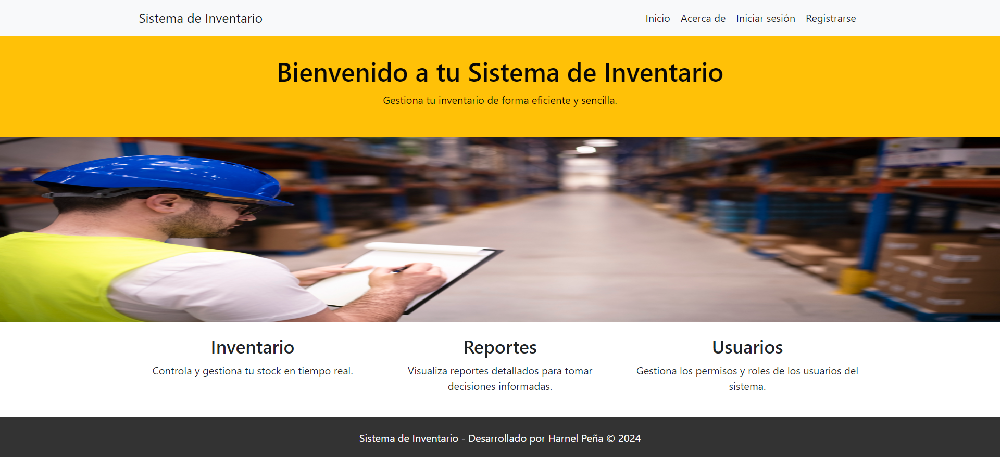
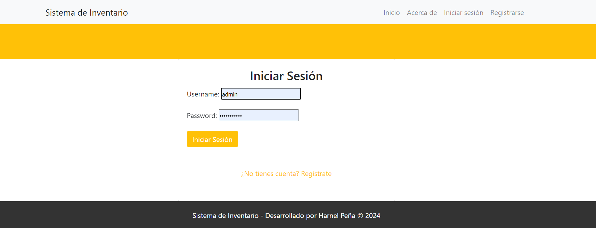
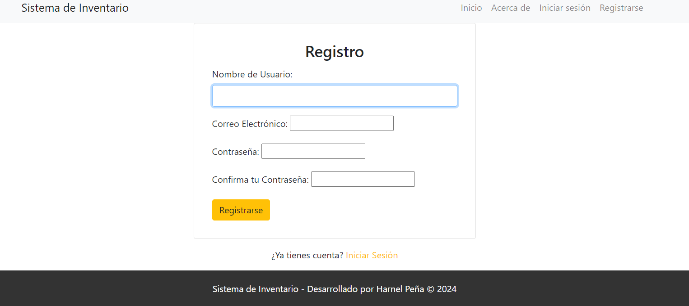
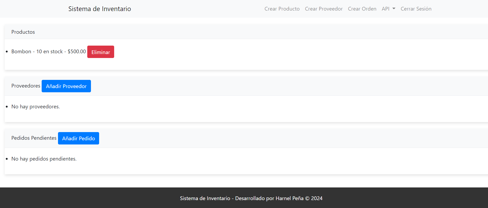
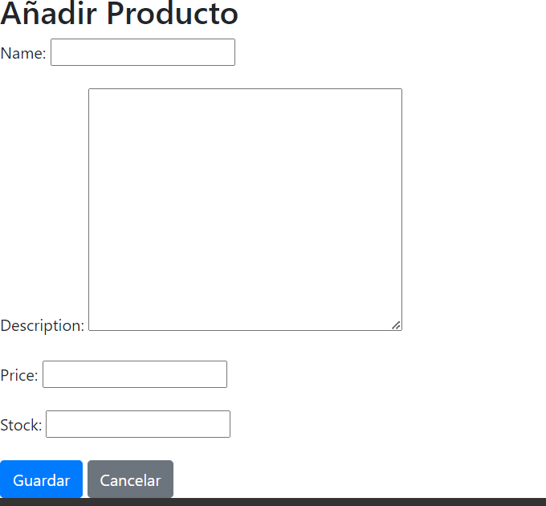
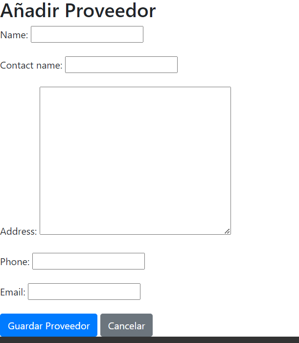
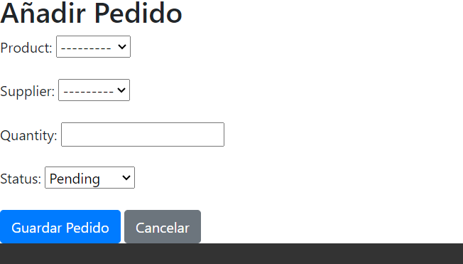
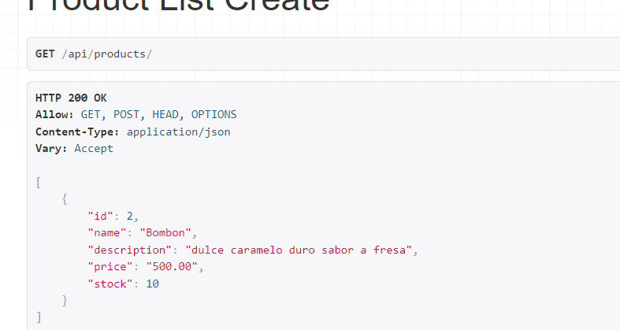

# Sistema de Inventario

Este Sistema es una aplicación web desarrollada con Django que proporciona una interfaz intuitiva y fácil de usar para la gestión de productos, proveedores y pedidos. Este sistema está diseñado para pequeñas y medianas empresas que buscan optimizar el control de su stock y mejorar sus procesos de logística y suministro.

## Comenzando

Estas instrucciones te proporcionarán una copia del proyecto en funcionamiento en tu máquina local para propósitos de desarrollo y pruebas.

## Instalación y Configuración

Asegúrate de tener Python y Django instalados en tu sistema. Para instalar este proyecto sigue los siguientes pasos:

1. Clona el repositorio en tu máquina local:

    ```bash
    git clone https://tu-repositorio.com/proyecto.git
    ```

2. Navega al directorio del proyecto:

    ```bash
    cd sistema_inventario
    ```

3. Instala las dependencias necesarias:

    ```bash
    pip install -r requirements.txt
    ```

4. Realiza las migraciones necesarias:

    ```bash
    python manage.py migrate
    ```

5. Inicia el servidor de desarrollo:

    ```bash
    python manage.py runserver
    ```

   Ahora puedes acceder a la aplicación en `http://127.0.0.1:8000/` en tu navegador.

Haz las modificaciones que consideres en tu VS o editor favorito.

## Uso

Para comenzar a usar el sistema, crea una cuenta de usuario y accede con tus credenciales. Navega a través de la barra de menú para acceder a las diferentes funcionalidades.

## Funcionalidades

- **Gestión de Productos**: Añadir nuevos productos, editar información existente y eliminar productos obsoletos o agotados.
- **Gestión de Proveedores**: Registrar nuevos proveedores, actualizar datos de contacto y eliminar registros no necesarios.
- **Gestión de Pedidos**: Crear pedidos, actualizar su estado y seguimiento hasta su finalización o cancelación.

### Productos

Para gestionar los productos:

Añadir un nuevo producto: Navegue hasta `Crear Producto` en la barra de navegación y rellene el formulario con los detalles del producto, incluyendo nombre, precio y stock.
Eliminar un producto: Junto a cada producto en la lista, hay un botón 'Eliminar'. Simplemente haga clic en este botón para eliminar el producto de su inventario.
Editar un producto: (Deje espacio aquí para detallar el proceso de edición de un producto).

#### Proveedores

Para gestionar los proveedores:

Añadir un nuevo proveedor: Seleccione `Crear Proveedor` y proporcione la información necesaria como el nombre del proveedor, nombre de contacto, dirección y detalles de contacto.
Eliminar un proveedor: Use el botón 'Eliminar' que se encuentra junto a cada proveedor en la lista para eliminarlo de su base de datos.
Editar un proveedor: (Deje espacio aquí para las instrucciones sobre la edición de proveedores).

#### Pedidos

Para la gestión de pedidos:

Crear un pedido: Haga clic en `Crear Orden` para añadir un nuevo pedido, seleccionando el producto deseado y la cantidad.
Actualizar el estado de un pedido: En la lista de pedidos pendientes, podrá cambiar el estado de cada pedido a completado o cancelado según corresponda.
Eliminar un pedido: Si necesita eliminar un pedido, utilice el botón `Eliminar` que aparece junto a cada pedido.
Navegación y sesión
Navegación: Utilice la barra de navegación para moverse entre las diferentes secciones del inventario, como productos, proveedores y pedidos.
Cerrar sesión: Para cerrar la sesión de su cuenta, haga clic en 'Cerrar Sesión' en la barra de navegación.

#### API

Si necesita acceder a la funcionalidad del sistema programáticamente, puede utilizar la API proporcionada:

Productos API: Le permite obtener una lista de productos y añadir nuevos productos a través de endpoints API.
Proveedores API: Utilice la API para consultar y gestionar los datos de los proveedores.
Pedidos API: La API también le permite interactuar con los pedidos realizados.

## Documentación API

El sistema incluye una API REST para la integración con otros sistemas o para el desarrollo de aplicaciones cliente. Consulta la documentación de la API en `http://127.0.0.1:8000/swagger/` para más detalles.

## Contribución

Si deseas contribuir a este proyecto, por favor envía un Pull Request con tus mejoras y una descripción detallada de tus cambios.

## Autor

- **Harnel Peña Peñaloza** - *Desarrollador inicial* - [linkedin](https://www.linkedin.com/in/harnel-peña/)

## Licencia

Este proyecto está bajo la Licencia MIT - ve el archivo `LICENSE.md` para más detalles.

## Reconocimientos

Agradecimientos especiales a todos los colaboradores y mentores de ADA School quienes nos motivaron al desarrollo de este proyecto.

## Capturas de Pantalla
















